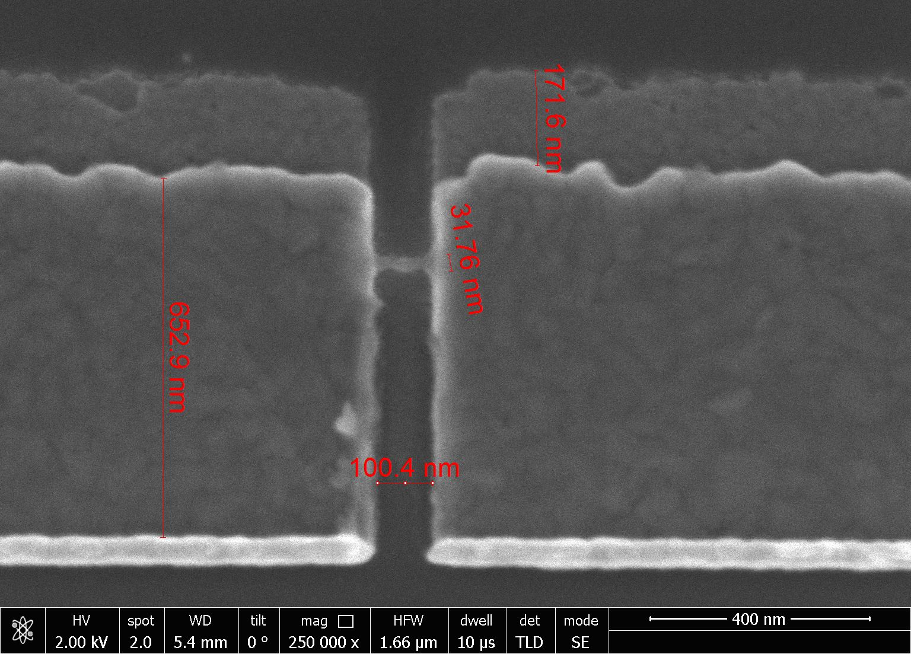
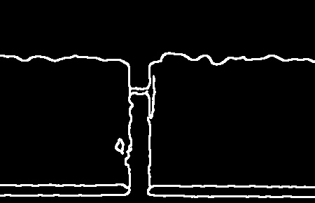

# Image Analysis Program for SEM Pictures of Quantum Devices:


This Python script processes SEM images, detects contours, and saves the contour images in a specified output directory. The script also crops the bottom 10% of the image before processing so that SEM information is not included in the contour analysis.

<p align="center">
  
  
</p>

## Requirements

- Python 3.x
- OpenCV
- scikit-image
- imutils

You can install the required libraries using the following command:

```bash
pip install opencv-python scikit-image imutils
```

## Usage

1. Save the script as `get_device_contour.py`
2. Prepare a directory with SEM images you want to process.
3. Open a terminal and navigate to the directory where the script is saved.

Run the following command:

```
python get_device_contour.py --input /path/to/your/input/directory
```

This command processes all the images in the specified input directory and saves the contour images in the "results" directory within the script's location.

You can change the low contrast threshold by adding the -t or --thresh argument, followed by a float value. For example:

```
python get_device_contour.py --input /path/to/your/input/directory --thresh 0.05
```

The default value for the threshold is 0.05.


---

## To Do:

- [ ] Measure the sizes of various features based on one measurement/the scale

- [ ] Generate analysis plots for dose tests of various features

- [ ] ML integration so that it can be trained based on inference codes for image classification (good bridge/dosimetry classification) in the future to speed up analysis task (https://arxiv.org/pdf/2203.08969.pdf)


